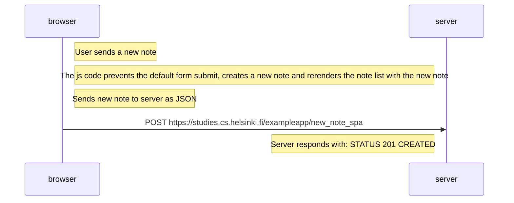

```mermaid
sequenceDiagram
    participant browser
    participant server

    Note right of browser: User sends a new note
    Note right of browser: The js code prevents the default form submit, creates a new note and rerenders the note list with the new note
    Note right of browser: Sends new note to server as JSON

    browser->>server: POST https://studies.cs.helsinki.fi/exampleapp/new_note_spa
    Note left of server: Server responds with: STATUS 201 CREATED
```